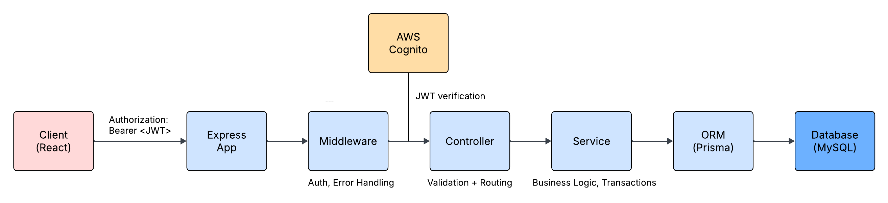

# 🌳 Notion Tree

A backend-focused fullstack application for organizing interests and reflections using a hierarchical, tag-based system.
This project emphasizes **data integrity, multi-tenant architecture, and scalable query design**.

---

## Overview

Notion Tree helps users track what they are learning and thinking about over time.  
It provides structured storage for interests, tagging, and reflections, enabling organized and reviewable learning.

The backend is designed with production-oriented concerns:
- Secure authentication
- Strict tenant isolation
- Scalable data access patterns
- Consistent validation and error handling

---

## Key Features

### 🔐 Authentication & Multi-tenancy
- JWT-based authentication via AWS Cognito
- Backend validates tokens on every request
- All data access strictly scoped by `userId`
- No client-controlled user identifiers
- Privacy-preserving responses (returns `404` instead of `403`)

### 🧠 Interest Management
- CRUD operations for interests
- Optional reflections (text content)
- Many-to-many relationship with tags
- `updatedAt` refreshed on access for recency tracking

### 🏷️ Tag System
- User-scoped tags
- Case-insensitive uniqueness (`nameNormalized`)
- Efficient filtering support

### 🔎 Filtering & Pagination
- Cursor-based pagination with stable ordering
- Sorting by `updatedAt` + `id`
- Filtering by:
  - Tags
  - Keyword search

### ⚙️ Data Integrity
- Prisma transactions prevent partial writes
- Zod validation ensures request correctness
- Consistent error handling across all endpoints

---

## Tech Stack

- **Backend:** Node.js, Express (TypeScript)
- **Database:** MySQL
- **ORM:** Prisma
- **Authentication:** AWS Cognito (JWT)
- **Validation:** Zod
- **Testing:** Vitest, Supertest
- **CI/CD:** GitHub Actions, Railway, Vercel

---

## Architecture

The system follows a layered architecture with external authentication.



### Design Decisions

- **Multi-tenancy enforced at query level**  
  All queries include `userId` to prevent data leakage

- **Cursor-based pagination**  
  Avoids performance issues of offset pagination at scale

- **Normalized relational schema**  
  Supports flexible querying and efficient indexing

---

## API Overview

### Interests
- GET /interests
- GET /interests/:id
- POST /interests
- PATCH /interests/:id
- DELETE /interests/:id

#### Example Query
GET /interests?limit=20&cursor=...&sort=desc&tagId=...&keyword=example

- Cursor-based pagination (base64 encoded)
- Stable ordering using `(updatedAt, id)`

---

### Tags
- GET /tags
- POST /tags
- DELETE /tags/:id
- Unique per user (`userId + nameNormalized`)

---

## Validation & Error Handling

- Zod-based validation for request bodies and query parameters
- Centralized error handling via Express middleware
- Typed error classes (`HttpError`) to standardize API responses
- Consistent response format:

{
  "message": "Error message",
  "details": {...}
}

- Unknown errors are safely handled as `500 Internal Server Error`

### Error Codes

| Code | Meaning |
|------|--------|
| 401  | Unauthorized (invalid/missing JWT) |
| 404  | Resource not found / not owned |
| 409  | Conflict (e.g., duplicate tag) |
| 422  | Validation error |
| 500  | Internal server error |

---

## Testing

- Integration and unit tests using Vitest and Supertest
- Tests executed in CI via GitHub Actions

### Coverage Highlights

- Authentication flows (login, refresh, logout)
- Tenant isolation (cross-user access returns 404)
- CRUD operations with database verification
- Cursor-based pagination (no duplication, stable ordering)
- Filtering logic (tags, keyword, combined conditions)
- Validation (invalid inputs, query constraints)
- Data integrity (transactional updates, cascade behavior)

---

## Database Design

### Key Indexes

- `Interest (userId, updatedAt, id)` → pagination
- `Tag (userId, nameNormalized)` → uniqueness
- `InterestTag (tagId, interestId)` → join efficiency

### Schema Highlights

- Many-to-many: `Interest ↔ Tag`
- No users table (Cognito is source of truth)
- `userId` derived from JWT `sub`

---

## CI/CD

### CI (GitHub Actions)
Runs on every push / PR:
- Install dependencies
- Prisma generate
- Lint + typecheck
- Run tests

### Deployment
- Backend: Railway
- Frontend: Vercel

---

## Getting Started

```bash
git clone <repo>
cd notion-tree
npm install
cp .env.example .env
npx prisma migrate dev
npm run dev